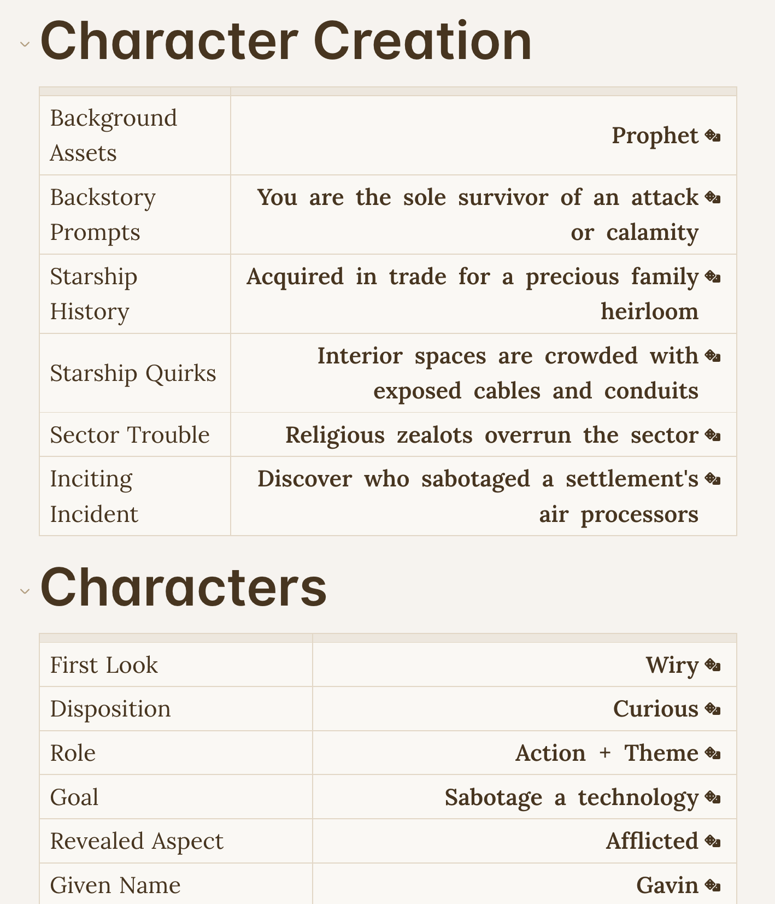

# Ironsworn for Obsidian

## Usage

- Copy the documents inside the `obsidian` directory into your Obsidian vault.
- Install the dice roller plugin.



## Changing how the markdown files are generated

If you want to change how the files are generated:

- Clone the [dataforged repository](https://github.com/rsek/dataforged) into `../dataforged`
- Edit `convert-oracles.py`
- Run `python3 convert-oracles.py ../dataforged/src/ironsworn/oracles.json`

Example:

```
$ python3 convert-oracles.py ../dataforged/src/ironsworn/oracles.json
Written obsidian/IronswornOracleTables.md and obsidian/IronswornOracle.md

$ convert-oracles.py ../dataforged/src/starforged/oracles.json
Written obsidian/StarforgedOracleTables.md and obsidian/StarforgedOracle.md
```

## Contributing

To contribute, feel free to send a PR.

Please take the following into account:

- Use only the Python standard library, so that the script will be easy to run for everyone.
- Run your changes through `mypy` and `black`.

## License

Text of Ironsworn and Ironsworn: Delve used under the Creative Commons Attribution-NonCommercial-ShareAlike 4.0 International license.

## Special Thanks

Thanks to Shawn Tomkin for the beautifully crafted Ironsworn and Starforged.

Thanks to [rsek](https://github.com/rsek) for creating [dataforged](https://github.com/rsek/dataforged).
